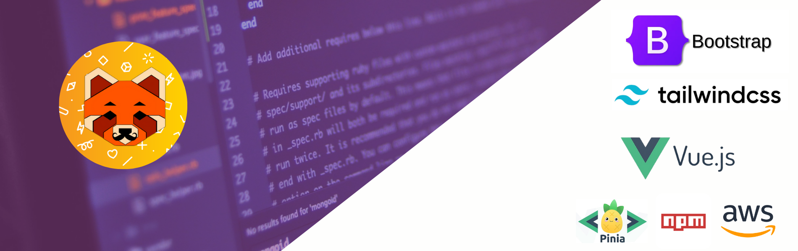

## 👋 Sobre mí

¡Hola! Soy **Roberto Andrés González Jiménez**, **desarrollador fullstack** con enfoque en **frontend**, especializado en la creación de **interfaces web modernas**, **escalables** y centradas en la **experiencia del usuario**. Me apasiona construir **soluciones eficientes** usando tecnologías como **Vue.js**, **React**, **TypeScript** y **Node.js**, integrando **APIs RESTful** y **arquitecturas modulares** en entornos **SaaS/B2B**.

Con formación técnica en **programación** y **análisis de sistemas**, y una trayectoria que combina **desarrollo**, **soporte técnico** y **coordinación de proyectos digitales**, aporto una visión **estratégica** y **colaborativa** a cada desafío. Me interesa tanto el **rendimiento** como la **usabilidad**, y disfruto **documentar procesos**, **automatizar flujos** y trabajar en **equipos ágiles**.

Además de mi perfil técnico, tengo experiencia en **medios digitales**, **UX/UI** y **arquitectura de información**, lo que me permite abordar el **desarrollo web** desde una perspectiva **multidisciplinaria**. Este repositorio reúne algunos de mis **proyectos**, **aprendizajes** y **experimentos creativos**. ¡Gracias por visitar!

<!--
**Robgonzalez/Robgonzalez** is a ✨ _special_ ✨ repository because its `README.md` (this file) appears on your GitHub profile.

Here are some ideas to get you started:

- 🔭 I’m currently working on ...
- 🌱 I’m currently learning ...
- 👯 I’m looking to collaborate on ...
- 🤔 I’m looking for help with ...
- 💬 Ask me about ...
- 📫 How to reach me: ...
- 😄 Pronouns: ...
- ⚡ Fun fact: ...
-->
